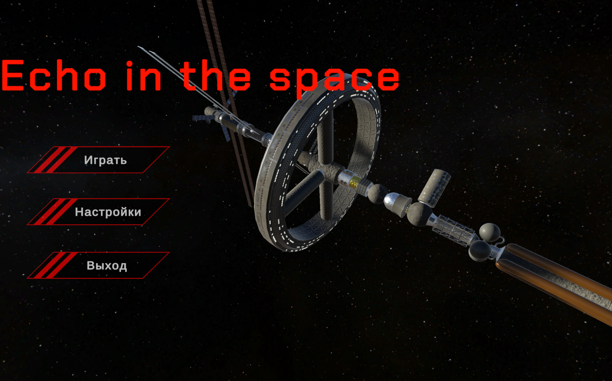
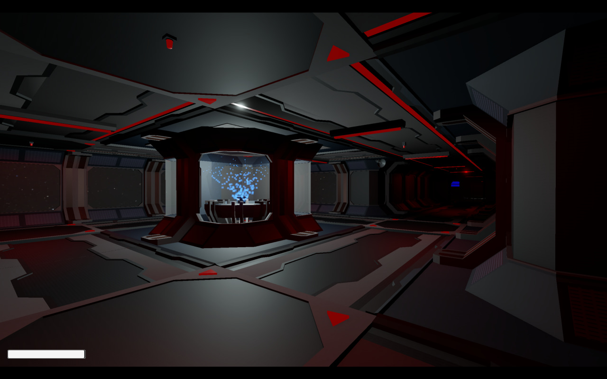
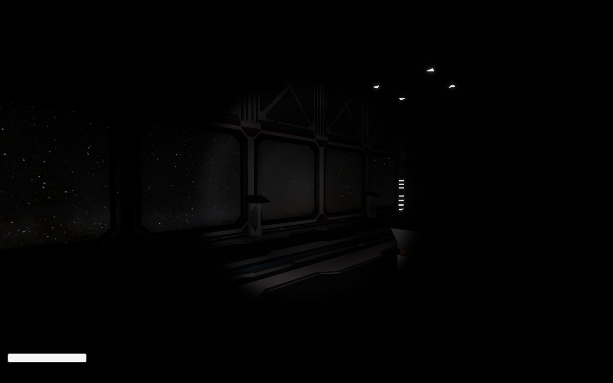
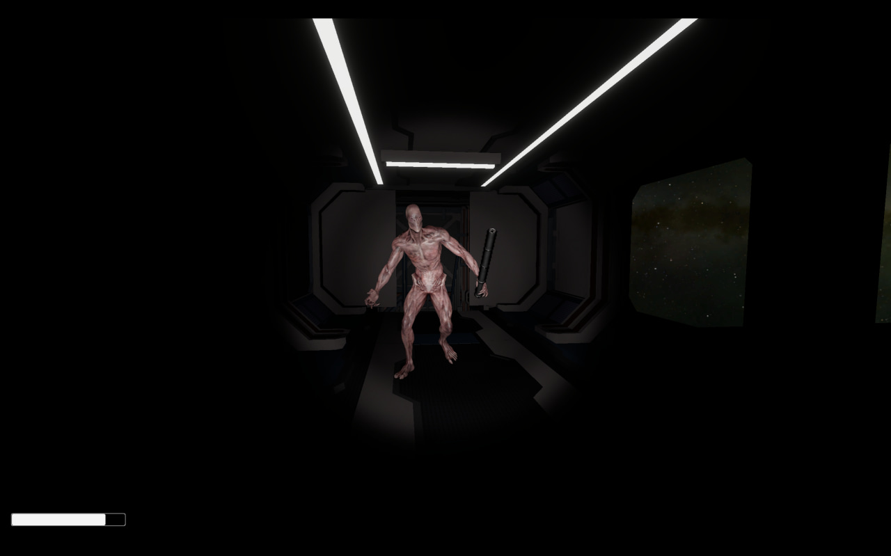
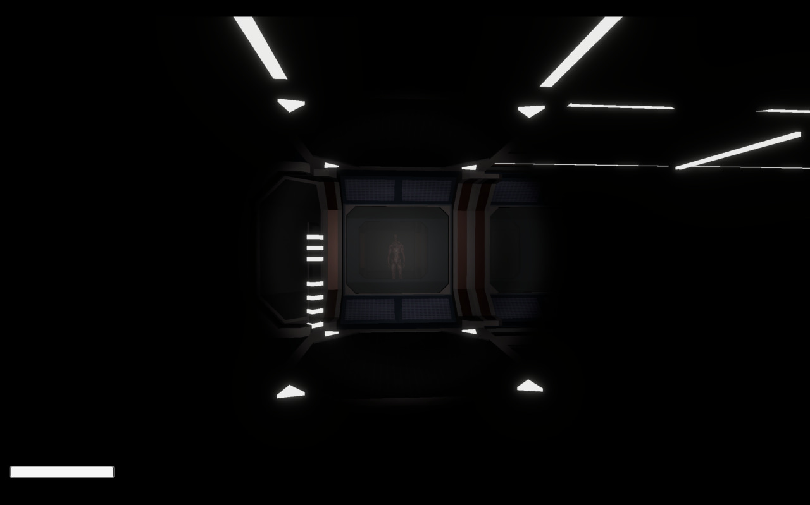

# Echo-in-the-space

## Описание

Игра на Unity, собранная из ассетов, скачанных в интернете, для проекта цифровой кафедры за две недели. Старались создать атмосферу с помощью звуков и музыки.

## Управление

Клавиши по умолчанию:

- Взаимодействие (открыть дверь, взять предмет, нажать кнопку): `E`
- Включить фонарик: `F`

## 📸 Скриншоты

Ниже — скриншоты из папки Screenshots/. Если хотите другую последовательность — скажите.

<table>
	<tr>
		<td align="center">
			 
			<strong>Меню</strong>
		</td>
		<td align="center">
			 
			<strong>Коридор</strong>
		</td>
		<td align="center">
			 
			<strong>Комната</strong>
		</td>
	</tr>
	<tr>
		<td align="center">
			 
			<strong>Враг (1)</strong>
		</td>
		<td align="center">
			 
			<strong>Враг</strong>
		</td>
		<td></td>
	</tr>
</table>